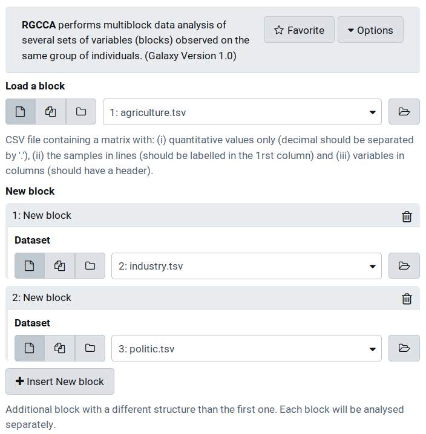
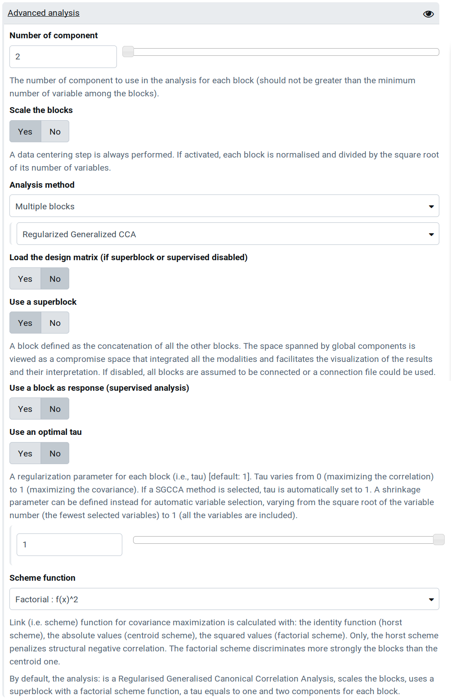
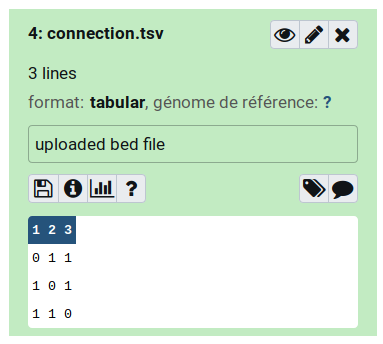
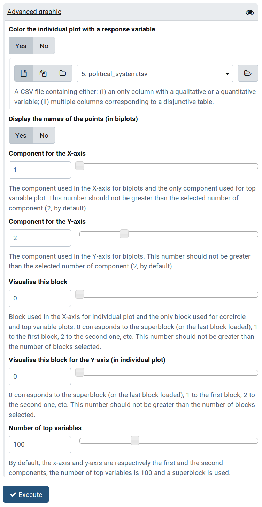

# TUTORIAL RGCCA GALAXY-TOOL 

##### Version: 1.0

##### Author: Etienne CAMENEN

##### Key-words: 
omics, RGCCA, multi-block

##### EDAM operation: 
analysis, correlation, visualisation

##### Contact: 
arthur.tenenhaus@centralesupelec.fr

##### Short description:
Performs multi-variate analysis (PCA, CCA, PLS, R/SGCCA, etc.) and produces textual and graphical outputs (e.g. variables and individuals plots).

---

## Contents
  - [Description](#description)
  - [1. Load the inputs](#1-load-the-inputs)
  - [2. Custom the analysis](#2-custom-the-analysis)
    - [2.1. Number of components and scaling](#21-number-of-components-and-scaling)
    - [2.2. Analysis methods](#22-analysis-methods)
    - [2.3. Connection between blocks](#23-connection-between-blocks)
      - [2.3.1. Loading a connection file](#231-loading-a-connection-file)
      - [2.3.2. Superblock](#232-superblock)
      - [2.3.3. Supervised analysis](#233-supervised-analysis)
    - [2.4. Other R/SGCCA parameters](#24-other-rsgcca-parameters)
      - [2.4.1. Shrinkage parameter (Tau)](#241-shrinkage-parameter-tau)
      - [2.4.2. Sparsity coefficient](#242-sparsity-coefficient)
      - [2.4.3. Scheme function (advanced users)](#243-scheme-function-advanced-users)
  - [3. Customize the graphics](#3-customize-the-graphics)
    - [3.1. Color the samples](#31-color-the-samples)
    - [3.2. Display names](#32-display-names)
    - [3.3. Components (for the x/y-axis)](#33-components-for-the-xy-axis)
    - [3.4. Block (for the x/y-axis)](#34-block-for-the-xy-axis)
    - [3.5. Number of top variables](#35-number-of-top-variables)
  - [4. Visualize the plot](#4-visualize-the-plot)
    - [4.1. Connection between blocks](#41-connection-between-blocks)
    - [4.2. Average variance explained (AVE)](#42-average-variance-explained-ave)
    - [4.3. Samples](#43-samples)
    - [4.4. Corcircle](#44-corcircle)
    - [4.5. Top variables](#45-top-variables)

## Description

We consider J data matrices X1 ,..., XJ. Each n × pj data matrix Xj = [ xj1, ..., xjpj ] is called a block and represents a set of pj variables observed on n individuals. The number and the nature of the variables may differ from one block to another, but the individuals must be the same across blocks. We assume that all variables are centered. The objective of RGCCA is to find, for each block, a weighted composite of variables (called block component) yj = Xj . aj, j = 1 ,..., J (where aj is a column-vector with pj elements) summarizing the relevant information between and within the blocks. The block components are obtained such that (i) block components explain well their own block and/or (ii) block components that are assumed to be connected are highly correlated. In addition, RGCCA integrates a variable selection procedure, called SGCCA, allowing the identification of the most relevant features (see [here](https://github.com/rgcca-factory/RGCCA#algorithm) for more information).

## 1. Load the inputs


In the tool-shed (left panel), select the « RGCCA » tool (**Fig. 1**). 

Download the pre-formatted files [here](https://github.com/rgcca-factory/RGCCA/tree/master/inst/extdata). This folder includes three blocks with the same individuals (corresponding to the countries here) but different types of variables (agriculture, industry and politic). In this dataset, according to Russett (1964), a high agriculture inequality and a low industrial development lead to unstable political regime. 

Download them in Galaxy (with the download button in green, **Fig. 1**). The accepted format is one (for PCA) or multiple TSV (tabulation as a column separator) files containing a matrix with:
- quantitative values only, with decimals separated by '.' and missing values labelled as "NA"
- samples in rows, labelled in the 1rst column with the same sample names between blocks (some samples could be missing in some blocks)
- variables in columns, labelled in the 1rst line without duplications in variable names between blocks


*Fig. 1 : Tool-shed of Galaxy with the "RGCCA" tool*

The structure of the dataset should be seen in the history panel (**Fig. 2**). 

 

*Fig. 2. History of Galaxy after downloading the three blocks from Russett data*

```Load a block``` in the "RGCCA" tool, for example ```agriculture.tsv``` (**Fig. 3**). 
Click on ```Insert New block``` to make new panels appear and to add 
```industry.tsv``` and ```politic.tsv```.

 

*Fig. 3. Graphical interface in Galaxy of "RGCCA". By default, an only parameter is required : an input file to analyze. Another dataset could be added for a multi-bloc analyze.*


## 2. Custom the analysis


The analyse parameters are all set by default (**Fig. 4**) and the user could directly click on the ```Execute``` button. To directly visualize the outputs, see the [last section](https://github.com/BrainAndSpineInstitute/rgcca_galaxy/tree/master#4-visualize-the-plot). These parameters could also be customized  by clicking on the "eye" icon.

 

*Fig. 4 : The second parameter panel shows various options to customize the analysis: choose the analysis and the number of components, scale the blocks, choose a shrinkage, use the superblock or a supervised approach, choose a link function.*

### 2.1. Number of components and scaling

With all analysis methods, the ```number of components``` could be changed. By default, it is set to two components (for biplots). In the software, the maximum of components allowed is *a posteriori* limited by the minimum number of columns between all datasets. In the case of Russet data, two components are allowed because of the two columns in the industry block. Select only the agriculture and the politic bloc to move the cursor to three components. In any case, the maximum value allowed is five components.

One could also selects ```scale [/ unscale] the blocks```. Either the option is selected or not, a data centering step is always performed. If selected, each block is normalized and then divided by the square root of its number of variables. When the data are already scaled, this step could be avoided by disabling the parameter.

### 2.2. Analysis methods

By default, the selected ```analysis method``` is set on ```RGCCA```. This tutorial will be focused on the RGCCA case, but another methods could be selected. For example, when only one block file is loaded in the previous step, a ```PCA``` could be performed. 

### 2.3. Connection between blocks

This parameters are to be only used only with R/SGCCA.

#### 2.3.1. Loading a connection file

The downloaded folder contains a design matrix (```connection.tsv```; **Fig. 5**) corresponding to the relationship between each block: 1 if two blocks are connected and 0 otherwise. The expected format should be tabulation-separated and should not have column and row names. It is a symmetric matrix with the same dimension as the number of blocks. This file allows to add *a priori* information of correlation hypothesis between the blocks. It will not be taken in account with a superblock (see next section). After disabling the ```use a superblock``` option, ```load the design matrix``` and observe the result on the plots. The ```connection.tsv``` file contains 1 in all non-diagonal cells and makes the assumption that all the blocks are related.



*Fig. 5. Supplementary files that could be used to customize the connection between the blocks in the analysis.*

#### 2.3.2. Superblock 
By default, all the blocks are connected to a superblock, a concatenation of all the other blocks. The space spanned by global components is viewed as a compromise space that integrated all the modalities and facilitates the visualization of the results and their interpretation. To visualize the blocks without the superblock, disable the ```Use a superblock``` option.

#### 2.3.3. Supervised analysis
By selecting ```supervised``` option, a slider bar appears to select the block used as a response. By selecting this block, all other blocks (predictors) will be only connected to this block. For example, select the ```1``` for the agriculture block (the first block loaded previously).

If a superblock is used, supervised analysis should be disabled, and inversely.

### 2.4. Other R/SGCCA parameters

#### 2.4.1. Shrinkage parameter (Tau)
```Optimal tau``` is automatically set for each block. This option is neither available with a superblock nor with a SGCCA. When disabled, one could make tau varying for each block from 1 (maximize the correlation between the variables of the selected block) to 0 (maximize the covariance). The value could also be set in the text field. 

#### 2.4.2. Sparsity coefficient
By selecting a SGCCA, the sparsity could be applied to each block. This coefficient varies from the inverse of the square root of the number of columns (the smaller set of variables) to 1 (all the variables are included).

After selecting the SGCCA mode, move the cursor to the ```0.75``` value to select less variables.

#### 2.4.3. Scheme function (advanced users)
```Scheme function``` allows to select the link (i.e. scheme) function for covariance maximizations between block components among: 
- identity (```Horst```)
- absolute values (```centroid```)
- squared values (```factorial```)

Only, the horst scheme penalizes structural negative correlation. The factorial scheme discriminates more strongly the blocks than the centroid one.


## 3. Customize the graphics


 

*Fig. 6 : The graphical option panel includes: (i) the loading of groups of response to color the samples (ii) the possibility to hide/print the names of the variables, (iii) the components used in the plots and (iv) the selection of the block to visualize. In this example, the superblock will be selected as the block for the X- and Y-axis.*

### 3.1. Color the samples
A variable could be used to color the points according to a response. For this, load the ``` political_system.tsv``` file (**Fig. 7**) in the corresponding ```Color the individual plot[...]``` box to update the plot. The expected format is a TSV file tabulation-separated with: 
- qualitative or quantitative values (decimals separated by '.') with missing values labelled as "NA"
- samples in lines, labelled in the 1rst column with the same sample names as the blocks (some samples could be missing)
- a header containing the names of the columns


*Fig. 7. Supplementary files that could be used to visualize the group of a response in the samples plot.*

### 3.2. Display names
If activated (by default), the ```display names``` option shows the name of the points in the biplots. If disabled, shapes are shown instead of text: one per group of modality.

### 3.3. Components (for the x/y-axis)
The ```component``` of the analysis allows to choose the space where the points are visualised. For the "top variable" histogram, the component is set by ```component for the x-axis```. For biplots tabs, either ```component for the x-axis``` or ```component for the y-axis``` could be set. By default, they are respectively set to the first and the second components. Their choices are limited by the number of components selected in the analysis (defined in the 2.1. section). If the number of components in RGCCA were greater than two (not allowed in the Russet example, because of the industry block), the ```component for the x-axis```, for example, could be set to the third one.

### 3.4. Block (for the x/y-axis)
By default, plots are shown with the ```superblock``` (i.e., the concatenation of all blocs; see [section 2.3.2](https://github.com/BrainAndSpineInstitute/rgcca_galaxy/tree/master#232-superblock)) to visualize all the blocs together. If this option is disabled, by default, the last blocks in the drop-down menu ```block``` is used (option ```0```). Choose another block (e.g., ```1``` for agriculture) to update the plots with your selection. For the ```individual``` plot, a ```block for the y-axis``` could also be selected.

### 3.5. Number of top variables
Used only in the  the "top variable" histogram, the maximum ```number of top variables``` is *a posteriori* automatically set to the number of variables in the selected blocks. For example, with Russet data, eleven "top" variables could be visualised by default on the superblock.


## 4. Visualize the plot 


Please, make sure that these options are set to visualise the same plots than those in the next examples:
- RGCCA method
- two components
- block scaled
- optimal tau
- a superblock
- factorial scheme

By executing the analysis (blue button at the bottom), four images, two tabular files and a RData should appear in the history panel. For each axis of the block, the corresponding percent of average explained variance is indicated in corresponding images.


### 4.1. Connection between blocks
```design.pdf``` summarizes the connection between each block: a link corresponds to a "1" value, in the matrix connection file (**Fig. 8**; see [section 2.3.1.](https://github.com/BrainAndSpineInstitute/rgcca_galaxy/tree/master#231-loading-a-connection-file)). For each block:
- "P" is the number of variables
- "N" is the number of lines (here, each block has the same number of line)
- "tau" is the shrinkage parameter and "sparsity" is the sparsity coefficient (see the [2.4.1 & 2.4.2 sections](https://github.com/BrainAndSpineInstitute/rgcca_galaxy/tree/master#24-other-rsgcca-parameters). The tau parameter could be shown for each component if the optimal option is selected


*Fig. 8 : Connection between each block of the RGCCA and the superblock with 47 common rows between blocks*

### 4.2. Average variance explained (AVE)
In ```ave.pdf``` the average variance explained (AVE; in X-axis) is represented in percent for each block (in Y-axis) and each component (one color per component) (**Fig. 9**). The subtitle informs about the AVE for the two first of the outer model (weighted average of the AVE of each block).


*Fig. 9 : Average variance variance explained (in %) for each block and for the two first components of the RGCCA*

### 4.3. Samples
```individual.pdf``` is the projection of the sample coordinates in the selected component of the analysis and, by default, on the superblock (a concatenation of all the blocks) (**Fig. 10**). If a ```response``` file is loaded, each sample is colored according to this variable. In the Russet example, the X-axis could discriminate a dictatorship (with upper values on this axis than the two other political systems), whereas the Y axis discriminates an unstable democracy (with upper values than the others).


*Fig. 10 : Samples coordinates on the two first components for the superblock of the RGCCA by loading the " political_system.tsv" file.*

### 4.4. Corcircle
```corcircle.pdf``` corresponds to the Pearson correlation between the variables of the block and the selected components in the analysis (by default, on the two first components) (**Fig. 11**). The circle is a 1 correlation and the dotted one is a 0.5 correlation. If the superblock is selected, colors correspond to the belonging of each variable to each block. Only the 100th variables the most correlated to each axis are printed.


*Fig. 11 : Correlation between each variable of each block (by using the superblock) and the two first components of RGCCA*

### 4.5. Top variables
```top_variables.pdf``` also represents the same correlation of the variable with the selected component (on the X-axis; 1 by default). The top variables are sorted decreasingly (on the Y-axis) in a histogram among the selected block (superblock, by default) (**Fig. 12**). Their number is set by the graphical associated parameter.


*Fig. 12 : Top 11 variables among all the blocks (by using the superblock) with higher correlation with the first component of the RGCCA. "Gnpr" (belonging to the industry block) shows a correlation of 0.859 with this component.*

Here, "labo" from the industry block (the amount of labor force in agriculture) is the variable the most positively correlated to the X-axis. On the opposite, "gnpr" (gross national product) from the industry block and "demostab" (stable democracy) from the political block are the most negatively correlated variables. In other terms, these variables are the most importants on the first component of the RGCCA. Countries with an unstable democracy are more associated with a lower "rent" (percent of farmers that rent their land). Otherwise, those with a dictatorship system are more associated with a higher labor force in agriculture values and a less gross national product (and inversely for the stable democracy case).